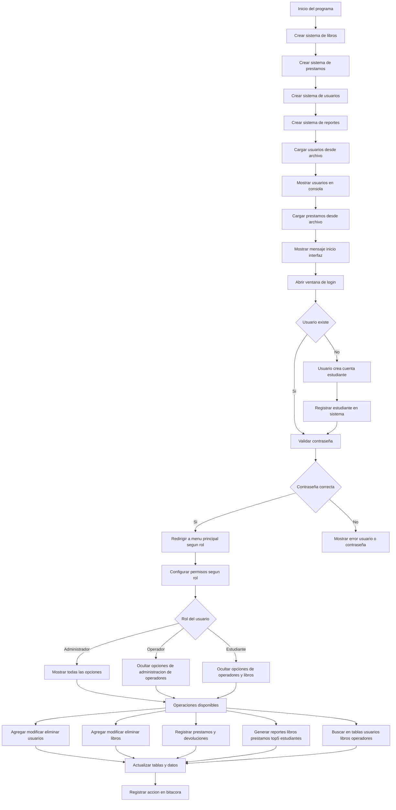
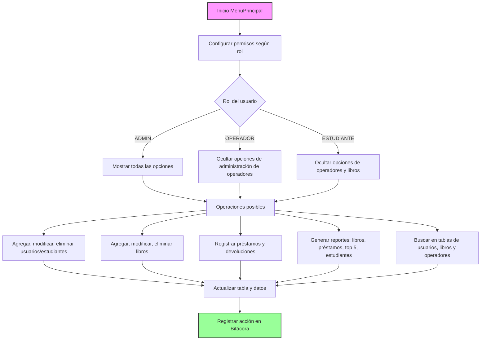

# Diagrama de Flujo del Sistema BiblioSystem

Este documento muestra los diagramas de flujo simplificados del proyecto **BiblioSystem**, incluyendo el inicio del programa, el login y el menú principal con las operaciones según el rol del usuario.  

---  

## Flujo de Inicialización del Sistema (Principal)

# 

## Flujo Simplificado del Menú Principal

